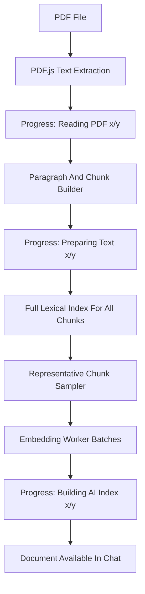
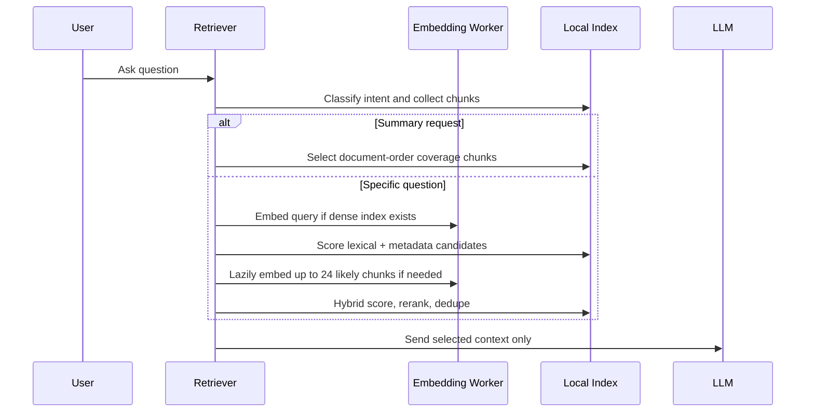

# Client-Side Retrieval-Augmented Generation (RAG) System

PDFOmni uses a fully client-side RAG engine for AI chat over uploaded PDFs. The implementation lives in [localCopilot.js](file:///src/ai/localCopilot.js), with embedding inference isolated in [embeddingWorker.js](file:///src/ai/embeddingWorker.js), and the chat upload/progress UI in [ChatSidebar.jsx](file:///src/components/AI/ChatSidebar.jsx).

The system keeps the zero-knowledge project model intact: PDF text extraction, chunking, indexing, retrieval, and embedding inference happen in the browser. User PDFs and retrieved context are not sent to a PDF indexing server or remote vector database. The only remote AI call is the final chat-completion request to the configured OpenRouter model, and only the selected retrieved text context is included in that prompt.

---

## 1. Current Defaults

| Constant | Default | Purpose |
| :--- | :--- | :--- |
| `embeddingDimensions` | `384` | Dense vector length returned by `Xenova/bge-small-en-v1.5`. |
| `chunkSize` | `900` | Maximum text characters per chunk before overlap splitting. |
| `chunkOverlap` | `140` | Characters carried into the next chunk for continuity. |
| `embeddingBatchSize` | `4` | Number of chunks sent to ONNX Runtime per worker batch. |
| `maxInitialEmbeddings` | `160` | Maximum representative chunks embedded during PDF upload. |
| `maxQueryEmbeddings` | `24` | Maximum query-relevant chunks lazily embedded during a question. |
| `candidateCount` | `18` | Candidate chunks kept after initial scoring. |
| `topK` | `4` | Default retrieved chunks sent to the LLM for specific questions. |
| `summaryTopK` | `10` | Document-order coverage chunks sent for summary requests. |
| `contextCharBudget` | `12000` | Maximum assembled context text size before prompting the LLM. |
| `retrievalRounds` | `2` | Query-only pass, then query plus short-term memory pass. |
| `denseWeight` | `0.42` | Dense embedding score weight. |
| `sparseWeight` | `0.40` | Lexical TF-IDF score weight. |
| `metadataWeight` | `0.18` | Document, page, section, and memory boost weight. |
| `memoryTurns` | `8` | Recent chat turns used for conversational memory expansion. |

---

## 2. Upload And Indexing Flow

When a user adds a PDF in the AI sidebar:



The key current behavior is that PDFOmni no longer blocks upload completion on dense embeddings for every chunk in a large document. A 500-page PDF can produce hundreds or thousands of chunks, so eager full-document embedding can appear frozen or fail inside ONNX Runtime. The current indexer always builds a complete lexical/text index for the whole PDF, then embeds a bounded representative sample (`maxInitialEmbeddings`) for semantic coverage.

The resulting document index stores:

- `chunks`: every indexed text chunk from every extracted page.
- `sparse`: global lexical statistics used for TF-IDF retrieval.
- `embeddingStatus`: `ready`, `partial`, or `failed`.
- `embeddedChunkCount`: number of chunks with dense vectors.
- `totalChunkCount`: total chunks in the document.
- `groups`: page-level references to chunk IDs.

---

## 3. Text Processing

### 3.1 PDF Text Extraction

PDF text is extracted with PDF.js via `extractAllText`. The chat sidebar now passes an extraction progress callback, so large PDFs show:

```text
Reading PDF (current/total)...
```

### 3.2 Whitespace Normalization

`normalizeWhitespace` standardizes PDF text before chunking:

1. Converts `\r` to `\n`.
2. Collapses repeated spaces and tabs.
3. Collapses excessive blank lines.
4. Trims leading and trailing whitespace.

### 3.3 Paragraph Detection

`paragraphCandidates` first splits text on blank-line block gaps:

```javascript
/\n\s*\n+/
```

If no block gaps are found, it falls back to sentence splitting with:

```javascript
/(?<=[.!?])\s+/
```

### 3.4 Section Labels

For each paragraph, the first line is treated as a possible section label if it is short and title-like:

```javascript
/^[A-Z0-9][A-Za-z0-9 :._()-]+$/
```

Otherwise the section is recorded as `Body`.

### 3.5 Chunking

Paragraphs shorter than `chunkSize` remain one chunk. Longer paragraphs are split by sentence while preserving `chunkOverlap`. If a PDF page contains very long text without sentence boundaries, the chunker now falls back to fixed-width overlapping slices so a single oversized PDF text run cannot overflow the embedding model.

---

## 4. Embeddings

### 4.1 Worker Model

Embeddings are generated in `embeddingWorker.js` with:

- Library: `@xenova/transformers`
- Model: `Xenova/bge-small-en-v1.5`
- Output: normalized 384-dimensional `Float32Array`
- ONNX backend: WebAssembly, single-threaded, SIMD disabled

The worker uses:

```javascript
{
  pooling: 'mean',
  normalize: true,
  truncation: true,
  max_length: 512
}
```

Worker text inputs are normalized and capped by `MODEL_MAX_CHARS = 1800` before inference. This avoids long PDF chunks triggering model-position or ONNX runtime failures.

### 4.2 Batch Strategy

The previous design sent every chunk in one large embedding request. The current design sends small batches of `embeddingBatchSize = 4`.

If a batch fails, the worker retries the same items one by one. If embeddings still cannot run, the document remains usable through the full lexical index and the UI reports a degraded indexing mode instead of failing the PDF upload.

### 4.3 Initial Semantic Coverage

For large PDFs, `selectInitialEmbeddingIndexes` samples up to `maxInitialEmbeddings` chunks across the full document order. This creates semantic coverage across the beginning, middle, and end of the PDF without requiring the browser to embed the entire document before chat can begin.

Possible outcomes:

- `ready`: all chunks were embedded.
- `partial`: the full text index is ready, and a representative subset has embeddings.
- `failed`: embedding inference failed, but lexical retrieval is still available.

---

## 5. Query-Time Retrieval

When a user asks a document-specific question, `retrieveLocalContext` works from all active chat documents marked `useInAi`.



### 5.1 Query Classification

The retriever detects:

- summary intent: `summarize`, `summarise`, `summarization`, `summary`, `tl;dr`, `overview`, and the common typo `summzrize`
- comparison intent: `compare`, `difference`, `versus`, `vs`
- analytical intent: `why`, `how`, `analyze`, `analysis`, `reason`, `impact`
- explicit document-name mentions

### 5.2 Summary Mode

For prompts like:

```text
summarize this document
```

the system does not rely on a generic query embedding. Instead it uses `summary-document-coverage` mode:

1. Selects the mentioned documents, or all active documents if none are named.
2. Samples document-order chunks across each document.
3. Sorts selected chunks back into reading order.
4. Sends up to `summaryTopK = 10` chunks within `contextCharBudget`.

This makes summaries use real PDF text coverage instead of pretending a broad query like "summarize this" can semantically locate every important section.

### 5.3 Specific Question Mode

For normal questions, the retriever combines:

- dense similarity from query/chunk embeddings when available
- sparse TF-IDF lexical score over all chunks
- metadata boosts from document mentions and chat memory

Final score:

```text
(dense * 0.42) + (sparse * 0.40) + (metadata * 0.18)
```

After upload, a large PDF may only have partial embeddings. During retrieval, `embedQueryCandidates` finds the top lexical/metadata candidates that are missing dense vectors and lazily embeds up to `maxQueryEmbeddings = 24` of them. This keeps upload fast while improving semantic ranking for the actual question asked.

### 5.4 Sparse TF-IDF

Sparse scoring uses per-chunk token frequency and index-wide document frequency:

```text
IDF = ln(1 + ((N - DF + 0.5) / (DF + 0.5)))
```

Lexical retrieval is not fake context: it still retrieves actual extracted PDF chunks. It is, however, lower quality than dense retrieval for paraphrased or conceptual queries, so the UI warns when embeddings failed.

### 5.5 Reranking And Dedupe

Candidates are reranked with token-overlap density plus small intent bonuses:

- summary section bonus: `+0.15`
- comparison bonus: `+0.12`

Candidates with the same first 180 text characters are removed to avoid repeated context.

---

## 6. Context Assembly

Selected chunks are sorted by:

1. `sourcePdf`
2. `pageNumber`
3. `paragraphIndex`
4. `chunkId`

The prompt context format is:

```text
[Source: filename.pdf, page 12, section Body, chunk filename.pdf::p12::para0::chunk0]
Actual extracted PDF text...
```

This source label lets the assistant cite document/page information in the final answer.

---

## 7. Chat Memory

After each assistant response, `updateLocalMemory` stores a capped rolling history of the last `memoryTurns = 8` turns.

It tracks:

- prior user questions
- assistant answers
- cited documents
- cited sections

Later queries use this to boost active documents and important sections, and to expand query tokens in the second retrieval round.

---

## 8. UI Progress And Large-PDF Behavior

The AI sidebar progress label can show:

```text
Reading PDF (x/y)...
Preparing text (x/y)...
Downloading AI model (x%)...
Building AI index (x/y)...
```

The upload button uses the shared `.animate-spin` CSS class so the loading icon visibly rotates.

For a 500-page PDF, expected behavior is:

1. Text extraction progresses by page count.
2. Chunking progresses by page count.
3. Initial semantic indexing progresses by representative embedding count, not total chunk count.
4. The document becomes available in chat with either `ready`, `partial`, or visible degraded fallback status.

---

## 9. Browser And Deployment Notes

The embedding model is downloaded by Transformers.js from the Hugging Face CDN on first use and cached by the browser. Browser privacy settings, incognito mode, network blocking, or CDN restrictions can prevent the model from loading. In that case PDFOmni does not fail the upload; it indexes the full text lexically and shows a warning.

Cloudflare Pages deployment should include the generated `dist/` contents. The production build outputs the app bundle, worker bundles, PDF.js worker, compressor app under `dist/compress`, `Cloudflare.txt`, and `dist.zip`.
